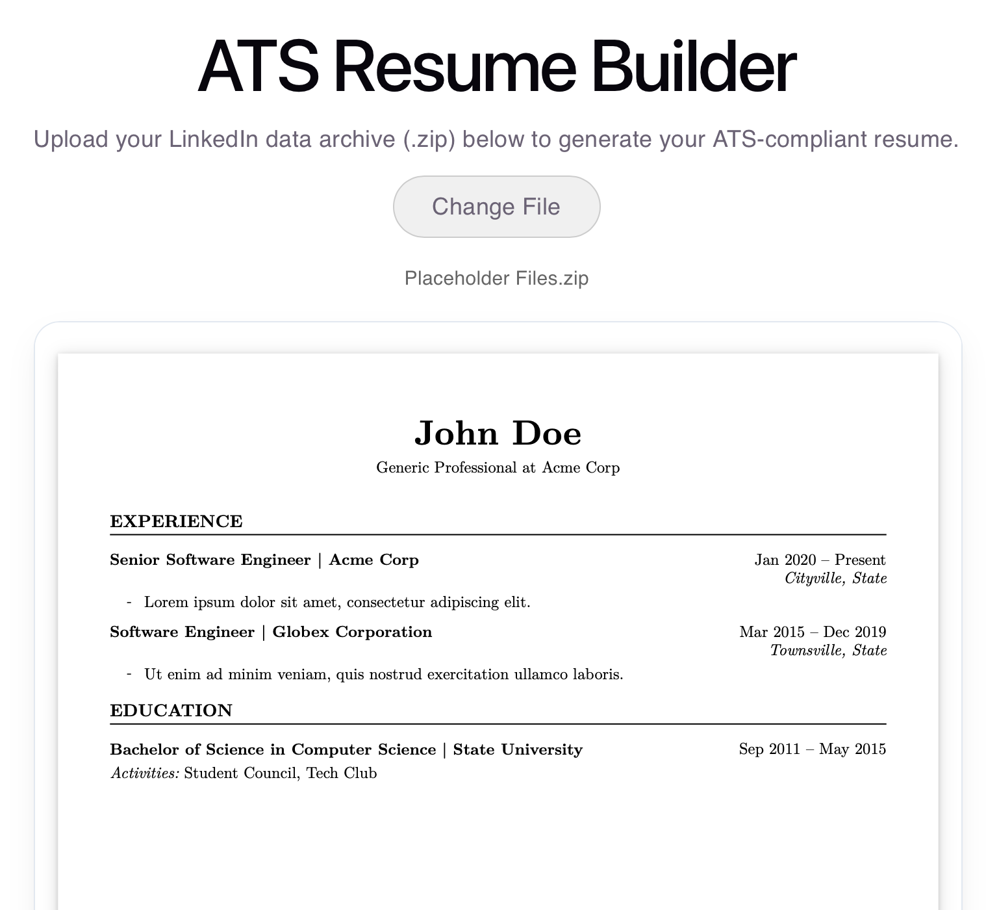
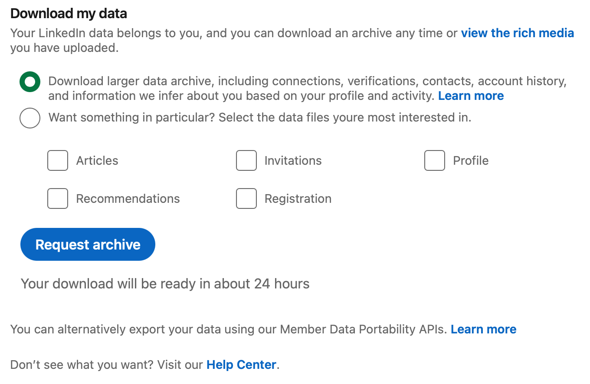

# ATS Resume Builder

A client-side React utility that parses profile data archives into Applicant Tracking System (ATS) compliant PDF resumes. Compatible with **LinkedIn data archives**.

### **🚀 [Try the Live Demo](https://P-Chatz.github.io/ats-resume-builder)**



## Features

* **100% Client-Side Privacy:** All processing happens entirely in your browser using `JSZip` and `PapaParse`. Your data never touches an external server.
* **Smart Archive Ingestion:** Automatically extracts required CSVs even if they are nested within subfolders inside the uploaded `.zip` file.
* **UTF-8 Resilience:** Built-in BOM-stripping parser fix (`transformHeader`) and text sanitization to clean up weird encoding artifacts or control characters in descriptions.
* **Multi-File Support:** Automatically ingests and maps `Profile.csv`, `Positions.csv`, and `Education.csv` into a unified schema.
* **ATS-Compliant PDF Rendering:** Compiles a clean, standard layout styled after [Jake's Resume template on Overleaf](https://www.overleaf.com/latex/templates/jakes-resume/syzfjbzwjncs) using `@react-pdf/renderer` with real-time live preview and automatic file naming (`FirstName-LastName-Resume.pdf`).

## Tech Stack

* **React** + **TypeScript**
* **JSZip** (Archive extraction)
* **PapaParse** (CSV parsing)
* **@react-pdf/renderer** (PDF generation & preview)

## How to Use

LinkedIn offers multiple data export options under its **"Get a copy of your data"** settings. This application parses information from the CSV files inside the **"Download larger data archive, including connections, verifications, contacts, account history, and information we infer about you based on your profile and activity"** package.



When requesting this larger archive, LinkedIn splits the download into multiple parts. This tool requires **Part 1** (typically downloaded as a `.zip` archive named something like `Basic_LinkedInDataExport_MM-DD-YYYY.zip`), which contains your core `Profile.csv`, `Positions.csv`, and `Education.csv` among other files.

### Expected CSV Schemas & Data Formats

To ensure the client-side parser reads your files successfully, your uploaded `.zip` archive should contain the following CSV files with matching header names:

#### 1. `Profile.csv`
* **Supported Columns:** `First Name`, `Last Name`, `Headline`, `Summary`

#### 2. `Positions.csv`
* **Supported Columns:** `Company Name`, `Description`, `Finished On`, `Location`, `Started On`, `Title`

#### 3. `Education.csv`
* **Supported Columns:** `Activities`, `Degree Name`, `End Date`, `School Name`, `Start Date`

---

## Getting Started

1. Clone the repository:
  ```bash
    git clone https://github.com/P-Chatz/ats-resume-builder.git
    cd ats-resume-builder
  ```

2. Install dependencies:
  ```bash
    npm install
  ```

3. Run the development server:
  ```bash
    npm run dev
  ```

## Acknowledgments

ATS Resume Builder relies on these excellent open-source libraries:
* **[JSZip](https://stuk.github.io/jszip/)** - For handling client-side zip archive extraction.
* **[PapaParse](https://www.papaparse.com/)** - For robust, asynchronous CSV parsing.
* **[@react-pdf/renderer](https://react-pdf.org/)** - For declarative PDF generation and live previewing.

---

*Disclaimer: This project is an independent open-source utility and is not affiliated with, endorsed, or sponsored by LinkedIn Corporation.*
